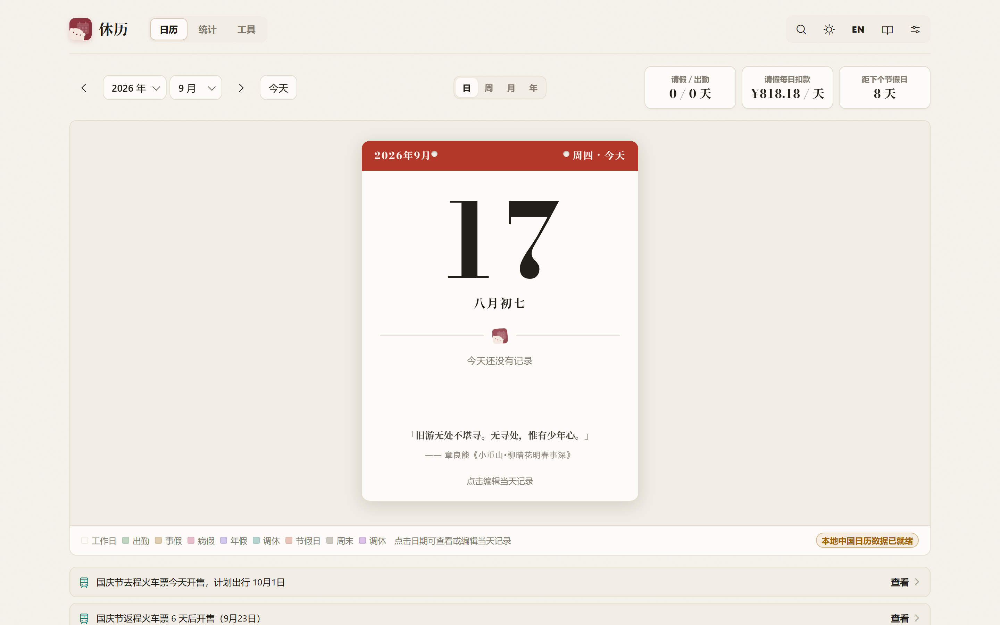
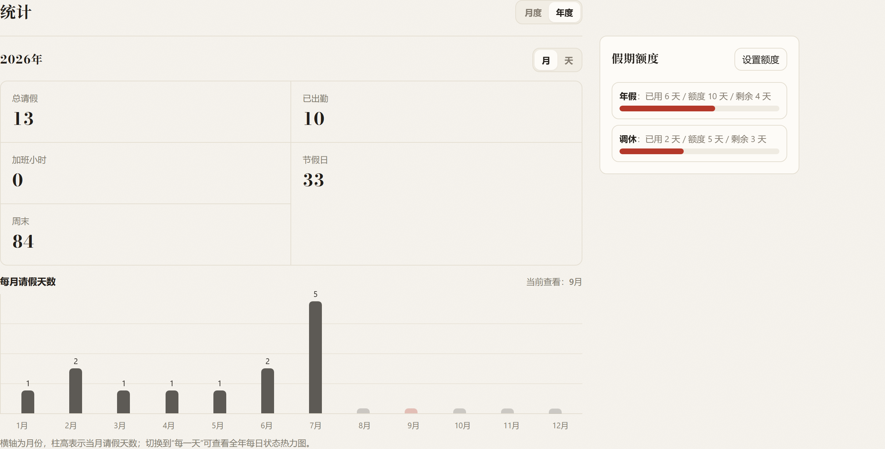
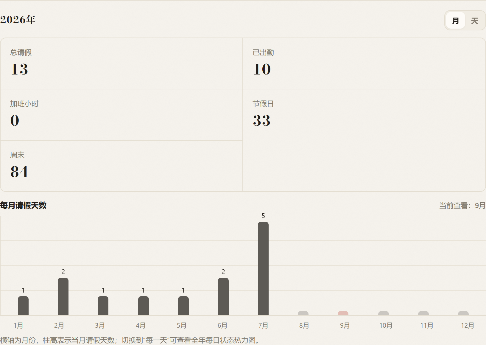
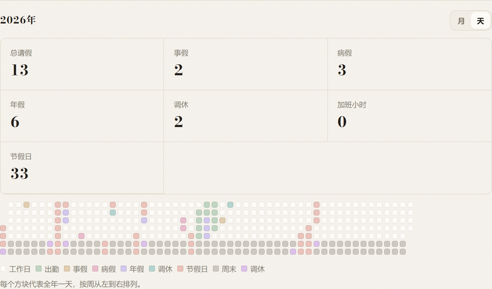
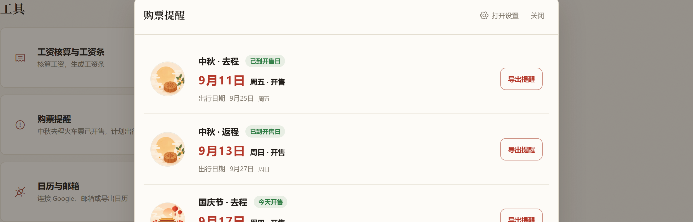
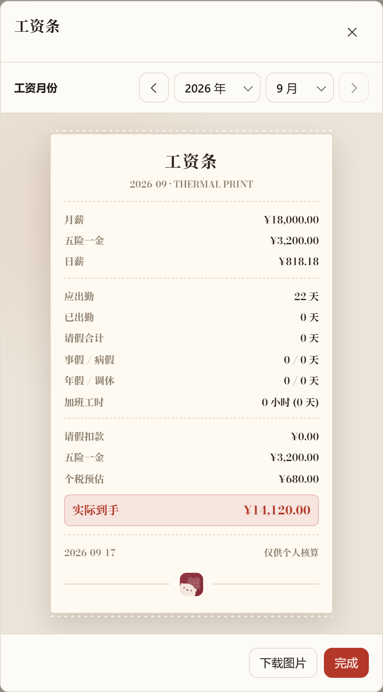
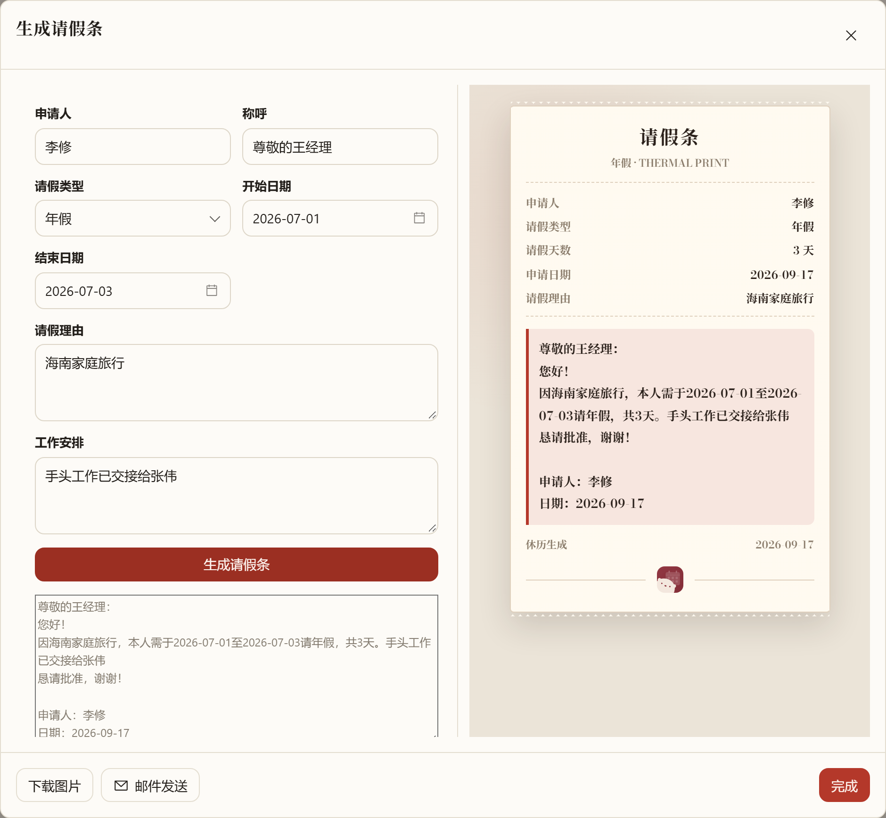
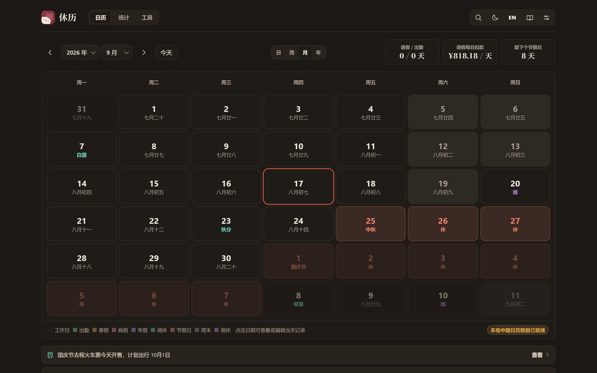
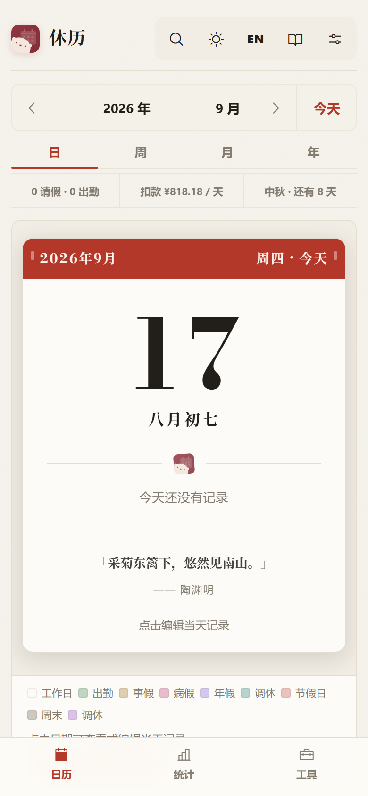
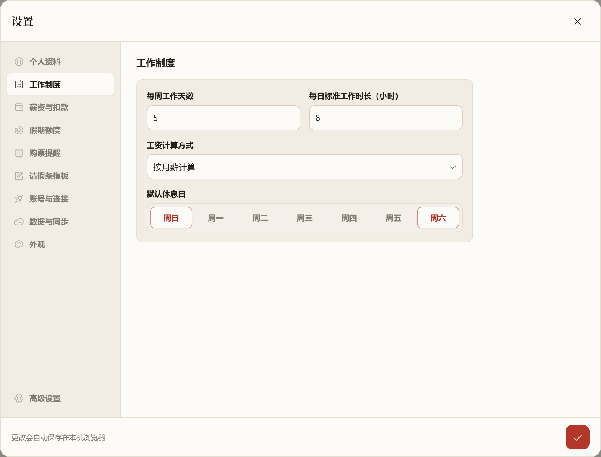

<div align="center">

[简体中文](README.md) · **English**


# RestCal · 休历

**Leave, attendance, payroll estimates, and ticket reminders — one calendar for the Chinese workplace**

[](LICENSE)


**[🌐 Open RestCal](https://restcal.abohack.com/app.html)** · [Product site](https://restcal.abohack.com) · [Telegram](https://t.me/restcalabohack) · **[Download v2.0.0 Android APK](https://github.com/skywalker23241/restcal-abohack/releases/tag/v2.0.0)** · [Report an issue](https://github.com/skywalker23241/restcal-abohack/issues)



*All screenshots use demonstration data.*

</div>

---

RestCal is a leave and attendance calendar designed for people working in China. Record attendance and leave across day, week, month, and year views; calculate working days, salary deductions, and estimated take-home pay; receive advance reminders for train-ticket sales around public holidays; and generate polished leave notes and salary slips.

It is a **zero-build, dependency-free frontend** written in native HTML, CSS, and JavaScript. No account is required, and data stays in your browser by default. RestCal works offline and supports optional CSV or WebDAV backups. Lunar dates, solar terms, statutory holidays, and adjusted working days for 2004–2026 are bundled locally.

The application interface can switch between Chinese and English. Language, theme, and all business settings are included in complete CSV and WebDAV backups.

## 🆕 What's new in v2.0.0

- Published an installable Android 2.0.0 APK with full-screen and Xiaomi HyperOS system-bar safe-area handling.
- Android WebDAV now uses a native transport supporting `PROPFIND`, `MKCOL`, `PUT`, and `GET` without browser CORS restrictions.
- The v1.6.0 Windows offline build remains available; existing data can be migrated through CSV or WebDAV.

- Added a theme-aware date picker and improved year/month selection, calendar cards, and the week-view hierarchy.
- Daily quotes now follow the interface language, with local fallback quotes when the network is unavailable.
- Improved the landing-page preview carousel to cover day, week, month, and year views as well as settings and backup features.
- Fixed extensionless `/app` routing, PWA navigation redirects, and caching of dynamic endpoints.
- Improved mobile modal scrolling, safe-area spacing, and responsive layouts throughout the app.
- Overtime is now stored alongside attendance or leave, with custom hours, conversion rates, batch scopes, and comp-time calculation.
- Added filtered RFC 5545 calendar exports; CSV backups now preserve all overtime fields while remaining backward compatible.

## ✨ Features

### 📅 Day, week, month, and year views

- The day view emphasizes the current date, lunar date, solar terms, and record status; week, month, and year views support planning at different levels.
- Every view combines Gregorian and lunar dates, solar terms, statutory holidays, adjusted working days, and weekends.
- Mark attendance and four leave statuses with one click. Overtime is stored alongside the day's status, and weekends support both overtime and standalone notes.
- Apply a status to a date range while automatically skipping weekends and holidays.
- Search leave records by keyword, status, or date range.

### 📊 Monthly and yearly statistics



<table>
  <tr>
    <td width="50%"></td>
    <td width="50%"></td>
  </tr>
</table>

- Monthly statistics cover expected working days, recorded attendance, leave by type, remaining annual leave, and a full monthly heatmap.
- Yearly statistics provide a monthly leave chart and a daily status heatmap for the entire year.
- Leave balances show total, used, and remaining annual leave and time off in lieu.

### 🧰 Three focused tools



- Payroll calculator and salary slip: calculate leave deductions and estimated take-home pay, then export a salary-slip image.
- Leave-note generator: turn saved records into a formal leave note that can be copied or downloaded.
- Ticket reminders: list train-ticket sale dates and countdowns for statutory holidays.

### 💰 Payroll calculator and salary slip

<div align="center"></div>

- Estimate monthly leave deductions and take-home pay from monthly salary, fixed deductions such as social insurance and housing fund contributions, and configurable deduction rates.
- Generate a thermal-receipt-style salary slip and download it as a PNG. See [Payroll calculation](#-payroll-calculation).

### 📝 Leave-note generator

<div align="center"></div>

- Enter the leave type, date range, and reason to generate formal leave-note text and a live receipt preview.
- Applicant, salutation, handover notes, and other defaults are remembered automatically. Copy the text or download the image.

### 🚄 Train-ticket reminders

RestCal calculates train-ticket sale dates for Chinese statutory holidays using a configurable advance-sale window of 15 days by default.

### 🌙 Dark mode



The theme follows the system by default and can be switched manually between automatic, light, and dark modes.

### 📱 Mobile and PWA

<div align="center"></div>

- The responsive mobile layout uses a compact overview, day cards, bottom navigation, and touch-friendly record sheets.
- Settings subpages provide clear back navigation, while record dialogs use a bottom-sheet interaction.
- Install RestCal on a desktop or home screen and use it completely offline. See [Install as a PWA](#install-as-a-pwa).

### ☁️ Backup and cloud sync

<div align="center"></div>

- Data is stored in the browser's `localStorage` by default and is not sent to a server.
- CSV import and export includes calendar records, profile, work schedule, salary, leave balances, leave-note defaults, theme, and language. Imports are validated before existing data is changed.
- WebDAV backup saves and restores the same complete dataset across devices. The WebDAV address and credentials remain on the current device and are never written to backup files. It works in the desktop app, local server, and Netlify deployment.

### 📆 System calendar integration

- Open any daily record and choose “Add to calendar” to carry its status, reason, overtime, and notes into the system calendar.
- The Android APK opens the system calendar's event editor for confirmation. The Windows app opens the default calendar application, while the web app downloads a single-event ICS file.
- Exported events include a `restcal://day/YYYY-MM-DD` return link. With the Android APK or Windows app installed, that link opens the matching date directly in RestCal.
- The web app also accepts date links in the form `https://restcal.abohack.com/app?date=YYYY-MM-DD`.

## 🚀 Quick start

| Option | Best for | How to start |
|---|---|---|
| **Web app** | Most users | Open [restcal.abohack.com/app.html](https://restcal.abohack.com/app.html); it can be installed as a PWA |
| **Windows app** | Browser-free use | Download the portable app, installer, or ZIP from the [v1.6.0 release](https://github.com/skywalker23241/restcal-abohack/releases/tag/v1.6.0) |
| **Local server** | Development or intranet use | Clone the repository, run `node server.js`, and open `http://localhost:8765/app.html` |

You can also open `public/app.html` directly (`public/index.html` is the product page). The application works offline under `file://`, but browsers do not register Service Workers or allow PWA installation in that mode. Use HTTP(S) when you need PWA features.

### Install as a PWA

Open RestCal over HTTP(S), either from the local server or an online deployment:

- Chrome or Edge on desktop: use the Install icon in the address bar.
- Android: choose “Add to Home screen” from the browser menu.
- iOS Safari: choose “Add to Home Screen” from the Share menu.

The application shell and bundled holiday, lunar-calendar, and solar-term data for 2004–2026 are cached from `public/assets/vendor/`. Only display fonts come from a CDN; system fonts are used when offline.

## 💻 Windows desktop app

Latest Android release: [RestCal v2.0.0](https://github.com/skywalker23241/restcal-abohack/releases/tag/v2.0.0)

Windows offline release: [RestCal v2.0.0](https://github.com/skywalker23241/restcal-abohack/releases/tag/v2.0.0)

| Download | Purpose |
|---|---|
| [`RestCal-2.0.0-portable.exe`](https://github.com/skywalker23241/restcal-abohack/releases/download/v2.0.0/RestCal-2.0.0-portable.exe) | Portable executable; no installation required |
| [`RestCal-2.0.0-setup.exe`](https://github.com/skywalker23241/restcal-abohack/releases/download/v2.0.0/RestCal-2.0.0-setup.exe) | Windows installer with a selectable installation directory |
| [`RestCal-2.0.0-win.zip`](https://github.com/skywalker23241/restcal-abohack/releases/download/v2.0.0/RestCal-2.0.0-win.zip) | Extract and run `休历.exe` |
| [`SHA256SUMS-2.0.0.txt`](https://github.com/skywalker23241/restcal-abohack/releases/download/v2.0.0/SHA256SUMS-2.0.0.txt) | File-integrity checksums |

All three packages include the application and Chinese calendar data for 2004–2026. The current builds are not code-signed, so Windows SmartScreen may display a warning on first launch.

The repository includes an Electron shell and can be built locally:

```bash
npm install
npm run dist
```

The `dist/` directory will contain a portable EXE, installer EXE, and ZIP. Users do not need Node.js or a browser to run them.

Notes:

- The desktop app loads the frontend through a custom `app://` protocol and uses the same lunar and holiday data as the web version.
- Electron stores data under `%APPDATA%\休历`, independently from browser storage. Use CSV or WebDAV backup to migrate between them.
- Run `npm start` to launch the desktop app in development.
- Electron downloads use the npmmirror mirror by default. If `npm install` is slow in mainland China, add `--registry=https://registry.npmmirror.com`.
- If the build fails with `Cannot create symbolic link` while extracting winCodeSign, enable Developer Mode in Windows and retry. Alternatively, extract [winCodeSign-2.6.0.7z](https://npmmirror.com/mirrors/electron-builder-binaries/winCodeSign-2.6.0/winCodeSign-2.6.0.7z) to `%LOCALAPPDATA%\electron-builder\Cache\winCodeSign\winCodeSign-2.6.0`; failures involving the two macOS symlinks can be ignored.

## 📱 Android APK

The Android build uses Capacitor to bundle the app pages and assets into an installable APK. It does not rely on the browser's PWA installation flow. Building requires JDK 17 and the Android SDK (Platform, Build-Tools, and Platform-Tools).

```bash
npm install
npm run build:android
```

The debug APK is written to `android/app/build/outputs/apk/debug/app-debug.apk` and can be installed directly on an Android phone for testing. `mobile/` is generated from `public/app.html` and `public/assets/` by `scripts/build-android-web.cjs`; do not edit it manually.

Installable APK: [RestCal-2.0.0-android-webdav.apk](https://github.com/skywalker23241/restcal-abohack/releases/download/v2.0.0/RestCal-2.0.0-android-webdav.apk). This build includes the native Android WebDAV transport; see [SHA256SUMS-2.0.0.txt](https://github.com/skywalker23241/restcal-abohack/releases/download/v2.0.0/SHA256SUMS-2.0.0.txt) for the checksum.

## 🛠 Deploy your own instance

### Netlify and WebDAV

Browsers cannot directly access WebDAV servers that do not permit CORS. A Netlify deployment automatically enables the repository's same-origin Function. Requests to `/__webdav` are forwarded securely, so users do not need a browser extension or a separate proxy URL.

1. In Netlify, choose `Add new project` → `Import an existing project` and connect this repository.
2. Leave the build command empty and set the publish directory to `public`.
3. Bind a custom domain under `Domain management` and follow Netlify's DNS instructions.
4. Open Settings → WebDAV Backup in RestCal, enter the URL, username, and password, then test the connection. Jianguoyun users should create an app-specific password under its security settings.

Only `dav.jianguoyun.com` is allowed by default to prevent the endpoint from becoming an open proxy. To use Nextcloud, Synology, or another service, add this variable under Netlify's `Project configuration` → `Environment variables`:

```text
WEBDAV_ALLOWED_HOSTS=dav.jianguoyun.com,dav.example.com
```

Enter comma-separated hostnames without protocols or paths, then redeploy. WebDAV is available through Netlify, the local `npm run serve` server, and the desktop application.

## 🔒 Data and privacy

Data is stored only in the browser's `localStorage` by default. RestCal does not collect or upload it automatically. WebDAV backup is optional: credentials remain on the current device and are not written to CSV or WebDAV backup files. During a backup, credentials and backup content pass through the site's Netlify Function but are not stored by the server. An app-specific WebDAV password is recommended.

Export a CSV regularly under Settings → Data & Sync, or configure WebDAV backup. Browser storage may be lost when changing browsers, clearing site data, or replacing a device.

### CSV fields

Exported CSV files use these columns:

```text
日期,状态,请假类型,请假理由,加班工时,调休倍率,加班事由,是否节假日,是否周末,备注,更新时间,用户设置(JSON)
```

The `用户设置(JSON)` column appears once in the first data row and contains the profile, work schedule, salary, leave balances, leave-note defaults, theme, and language. A settings row is retained even when no calendar records exist. Older CSV files without overtime fields or this settings column remain supported.

Supported status values:

```text
出勤,事假,病假,年假,调休
```

Export filename:

```text
休历-完整备份-YYYY-MM-DD.csv
```

Imports validate the columns, date format, and status values before replacing any existing data.

## 🧮 Payroll calculation

Default calculation rules:

- Expected attendance days: weekdays plus adjusted working days, excluding weekends and statutory holidays.
- Actual attendance days: working days explicitly marked as present.
- Daily pay: monthly salary / expected attendance days.
- Leave deduction: days of each leave type × daily pay × the configured deduction rate.

Default deduction rates:

- Personal leave: 100%
- Sick leave: 50%
- Annual leave: 0%
- Time off in lieu: 0%

All rates can be changed in Settings.

## 📅 Holiday data

Holiday, adjusted-working-day, lunar-calendar, and solar-term data comes from [Chinese Days](https://chinese-days.yaavi.me/). Data for 2004–2026 is bundled under `public/assets/vendor/chinese-days/` and does not require a network connection.

For years that are not bundled, RestCal requests the official annual dataset from jsDelivr and caches successful responses for offline use. If official data has not yet been published, attendance, payroll, and ticket-reminder calculations for that year are paused instead of treating ordinary weekend rules as an official holiday schedule.

When a new annual dataset is released, download `https://cdn.jsdelivr.net/npm/chinese-days/dist/years/<year>.json` into `public/assets/vendor/chinese-days/years/`, then run:

```bash
npm run build:calendar
```

## 🧱 Project structure

```text
.
├── public/               # Publish root for Netlify and the local server
│   ├── index.html        # Bilingual product landing page
│   ├── app.html          # Main application page
│   ├── manifest.webmanifest
│   ├── sw.js             # PWA offline cache
│   └── assets/
│       ├── css/          # Stylesheets
│       ├── js/           # Application scripts and offline calendar bundle
│       ├── icons/        # PWA and desktop icons
│       ├── images/       # Social image and product screenshots
│       └── vendor/       # Bundled lunar and holiday data
├── scripts/              # Icon, screenshot, calendar-data, and layout tools
├── docs/roadmap.md       # Product roadmap
├── netlify/functions/webdav.mjs  # Same-origin WebDAV proxy
├── netlify.toml          # Netlify publish and Function configuration
├── desktop/main.js       # Electron shell for Windows
├── package.json          # Desktop dependencies and packaging configuration
├── server.js             # Local static server and same-origin WebDAV proxy
├── README.md             # Chinese documentation
└── README.en.md          # English documentation
```

## 🤝 Contributing

Issues and pull requests are welcome. See [CONTRIBUTING.md](CONTRIBUTING.md) for the contribution workflow.

Increment `CACHE_VERSION` at the top of `public/sw.js` before publishing static-resource changes, otherwise installed PWA clients may continue using an old cache.

## 📄 License

RestCal is released under the [MIT License](LICENSE).
