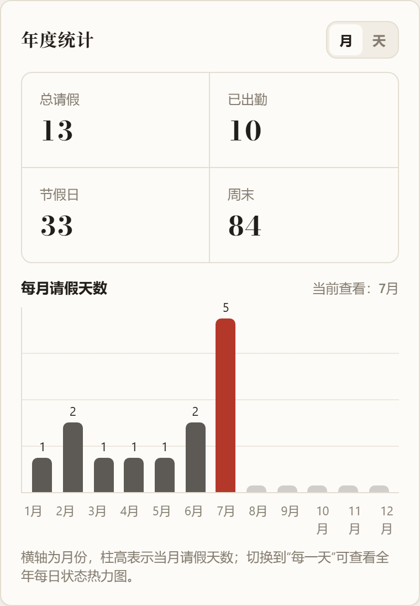
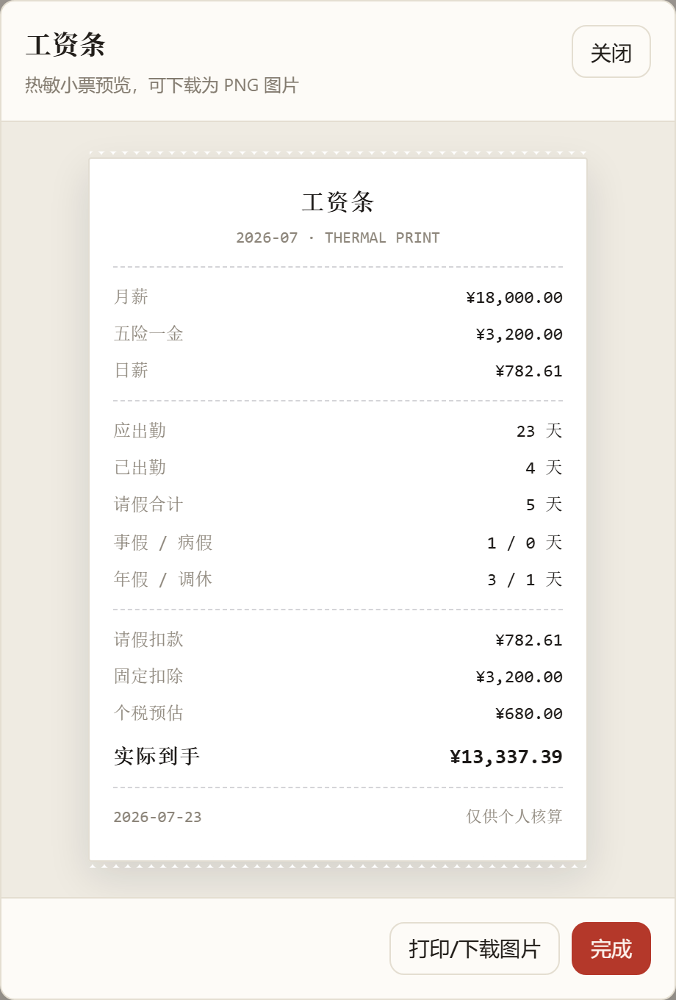
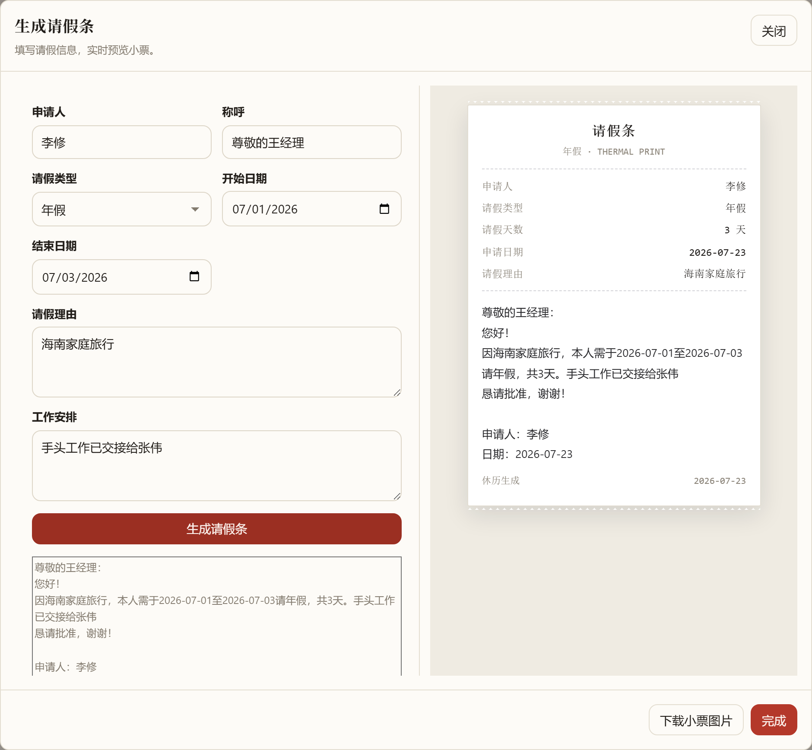
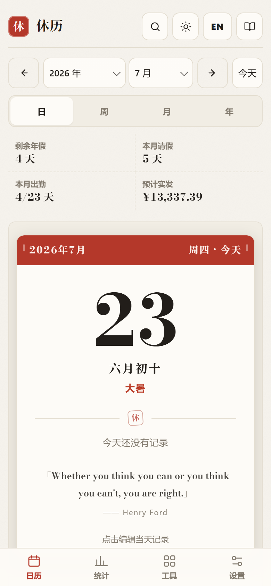
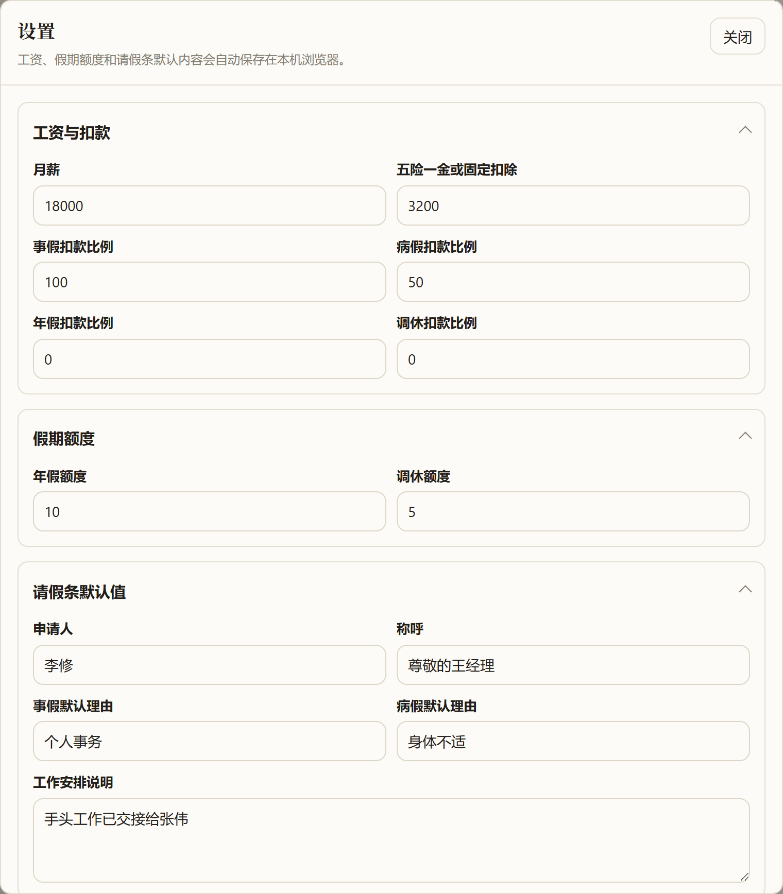

<div align="center">


# 休历 · RestCal

**请假、出勤、工资核算、购票提醒 —— 一页搞定的中国职场日历**

[](LICENSE)


**[🌐 立即使用](https://restcal.abohack.com/app.html)** · [产品主页](https://restcal.abohack.com) · [Telegram 频道](https://t.me/restcalabohack) · **[下载 v1.4.0 离线版](https://github.com/skywalker23241/restcal-abohack/releases/tag/v1.4.0)** · [问题反馈](https://github.com/skywalker23241/restcal-abohack/issues)


*文档中的截图均为演示数据*

</div>

---

休历是一个为中国职场人打造的请假日历工具：在月历上标记出勤和请假，自动算出勤天数、扣薪和到手工资，提前提醒节假日火车票开售，还能一键生成正式的请假条和工资条小票。

**纯前端、零构建、零依赖**——原生 HTML/CSS/JavaScript 实现，数据全部保存在本机浏览器，不注册、不上传、离线可用。农历、节气、法定节假日与调休数据（2004–2026）已完整打包在本地。

应用界面支持中文与英文一键切换；语言、主题以及所有业务设置都可以随 CSV 或 WebDAV 完整备份和恢复。

## ✨ 功能一览

### 📅 月历与请假标记

- 月历同时展示公历、农历、节气、法定节假日、调休补班和周末。
- 五种状态一键标记：出勤、事假、病假、年假、调休，支持填写请假理由和备注。
- 批量标记：选择起止日期，自动跳过周末和节假日，一次性应用到多个工作日。
- 全局搜索：按关键词、状态、日期范围快速筛选请假记录。

### 📊 月度与年度统计

<table>
  <tr>
    <td width="50%"></td>
    <td width="50%"></td>
  </tr>
</table>

- 本月统计：应出勤、已出勤、各类请假天数、剩余年假，配合完整可见的月度热力图。
- 年度统计：按月查看请假天数柱状图，或切换到全年每日状态热力图。
- 假期额度：年假、调休的总额度与已用、剩余天数一目了然。

### 💰 工资核算与工资条

<div align="center"></div>

- 按月薪、固定扣除（五险一金等）和各请假类型的扣款比例，实时估算当月扣薪与实际到手。
- 一键生成热敏小票风格的工资条，可下载为 PNG 图片。计算规则见[工资计算说明](#-工资计算说明)。

### 📝 一键生成请假条

<div align="center"></div>

- 填写请假类型、起止日期和理由，实时生成正式的请假条文本与小票预览。
- 申请人、称呼、工作交接等默认值自动记忆，可复制文本或下载小票图片。

### 🚄 火车票购票提醒

按中国法定节假日自动计算火车票开售时间（默认提前 15 天），假期出行不再错过抢票节点。

### 🌙 深色模式


默认跟随系统，也可在顶栏于自动、浅色、深色之间手动切换。

### 📱 移动端与 PWA

<div align="center"></div>

- 响应式布局，手机上以核心状态卡片 + 紧凑月历呈现。
- 支持安装到桌面 / 主屏幕，安装后完全离线可用（见[安装为应用](#安装为应用pwa)）。

### ☁️ 备份与云同步

<div align="center"></div>

- 数据默认保存在本机浏览器 `localStorage`，不经过任何服务器。
- CSV 导入导出：同时保存日历记录、个人资料、工作制度、工资、假期额度、请假条默认值、主题和语言，适合手动备份和跨浏览器迁移；导入前自动校验格式。
- WebDAV 云备份：一键完整备份上述数据到坚果云等 WebDAV 网盘并跨设备恢复。WebDAV 地址和账号凭据只保存在当前设备，不写入备份文件。桌面版、本地运行及 Netlify 在线版开箱即用。

## 🚀 快速开始

| 方式 | 适合场景 | 上手方法 |
|---|---|---|
| **在线版** | 大多数用户 | 直接打开 [restcal.abohack.com/app.html](https://restcal.abohack.com/app.html)，可安装为 PWA |
| **桌面版** | Windows 免浏览器使用 | 从 [v1.4.0 Release](https://github.com/skywalker23241/restcal-abohack/releases/tag/v1.4.0) 下载便携版、安装版或 ZIP |
| **本地运行** | 开发或内网使用 | 克隆仓库后 `node server.js`，访问 `http://localhost:8765/app.html` |

也可以直接双击打开 `app.html` 使用（站点根路径的 `index.html` 是介绍页，应用本体在 `app.html`）。`file://` 模式本身可以离线运行，但浏览器不会注册 Service Worker，也不能将其安装为 PWA；需要 PWA 能力时请通过 HTTP(S) 打开。

### 安装为应用（PWA）

通过 HTTP(S) 访问页面后（本地服务器或线上站点），可以把休历安装成应用：

- 桌面 Chrome / Edge：地址栏右侧的「安装」图标。
- Android：浏览器菜单中的「添加到主屏幕」。
- iOS Safari：分享菜单中的「添加到主屏幕」。

安装后离线也能使用：应用壳、节假日、农历和节气数据都已打包在本地（`vendor/` 目录，含 2004–2026 年），由 Service Worker 缓存。仅标题字体来自 CDN，离线时回退到系统字体。

## 💻 桌面版（Windows）

最新离线版：[RestCal v1.4.0](https://github.com/skywalker23241/restcal-abohack/releases/tag/v1.4.0)

| 下载 | 用途 |
|---|---|
| [`RestCal-1.4.0-portable.exe`](https://github.com/skywalker23241/restcal-abohack/releases/download/v1.4.0/RestCal-1.4.0-portable.exe) | 免安装，下载后直接运行 |
| [`RestCal-1.4.0-setup.exe`](https://github.com/skywalker23241/restcal-abohack/releases/download/v1.4.0/RestCal-1.4.0-setup.exe) | Windows 安装程序，可选择安装目录 |
| [`RestCal-1.4.0-win.zip`](https://github.com/skywalker23241/restcal-abohack/releases/download/v1.4.0/RestCal-1.4.0-win.zip) | 解压后运行 `休历.exe` |
| [`SHA256SUMS-1.4.0.txt`](https://github.com/skywalker23241/restcal-abohack/releases/download/v1.4.0/SHA256SUMS-1.4.0.txt) | 下载文件完整性校验值 |

三个程序包均包含应用和 2004–2026 年中国日历数据，无网络时也能使用。当前构建尚未进行代码签名，Windows SmartScreen 可能在首次运行时显示提醒。

项目自带 Electron 壳，也可以自行构建：

```bash
npm install
npm run dist
```

构建完成后，`dist/` 目录会生成便携版 EXE、安装版 EXE 和 ZIP，运行时无需安装 Node 或浏览器。

说明：

- 桌面版内部通过自定义 `app://` 协议加载页面，农历、节假日数据与网页版完全一致。
- 数据保存在 Electron 的本地存储中（`%APPDATA%\休历`），与浏览器中的数据互相独立，可通过完整 CSV 或 WebDAV 备份迁移。
- 开发调试可以运行 `npm start` 直接启动桌面窗口。
- 国内网络下 Electron 二进制会自动走 npmmirror 镜像；如果 `npm install` 较慢，可加 `--registry=https://registry.npmmirror.com`。
- 如果构建报错 `Cannot create symbolic link`（解压 winCodeSign 时缺少权限），可以在 Windows 设置中开启「开发者模式」后重试，或手动把 [winCodeSign-2.6.0.7z](https://npmmirror.com/mirrors/electron-builder-binaries/winCodeSign-2.6.0/winCodeSign-2.6.0.7z) 解压到 `%LOCALAPPDATA%\electron-builder\Cache\winCodeSign\winCodeSign-2.6.0`（两个 macOS 符号链接解压失败可忽略）。

## 🛠 部署自己的实例

### GitHub Pages

这个项目是静态页面，可以直接部署到 GitHub Pages：

1. 将项目提交到 GitHub 仓库。
2. 进入仓库 `Settings` → `Pages`。
3. Source 选择 `Deploy from a branch`。
4. Branch 选择 `main`，目录选择 `/root`。
5. 保存后访问 GitHub Pages 地址。

### Netlify 部署与网页版 WebDAV

浏览器不能直接访问未开放 CORS 的 WebDAV 服务。Netlify 部署会自动启用仓库中的同源 Function，网页请求 `/__webdav` 时由该 Function 安全转发，因此用户无需安装扩展或填写额外代理地址。

1. 在 Netlify 选择 `Add new project` → `Import an existing project`，连接本仓库。
2. Build command 留空，Publish directory 填 `.`，然后部署。
3. 在 `Domain management` 中绑定自定义域名，并按 Netlify 提示修改 DNS。
4. 打开线上站点的设置 → WebDAV 云备份，填写地址、用户名和密码，点击「测试连接」。坚果云需使用在安全选项中生成的应用专用密码。

默认只允许连接坚果云 `dav.jianguoyun.com`，以免接口被滥用为公开代理。若使用 Nextcloud、群晖等其他服务，请在 Netlify 的 `Project configuration` → `Environment variables` 中添加：

```text
WEBDAV_ALLOWED_HOSTS=dav.jianguoyun.com,dav.example.com
```

填写逗号分隔的域名，不要包含协议或路径，然后重新部署。GitHub Pages 仍可展示静态页面，但无法运行 Netlify Function，所以网页版 WebDAV 仅在 Netlify、本地 `npm run serve` 和桌面版中可用。

## 🔒 数据与隐私

用户数据默认只保存在本机浏览器 `localStorage` 中，不采集、不自动上传。WebDAV 备份是可选功能，凭据只持久化在本机且不会写入 CSV 或 WebDAV 备份文件；执行备份时，凭据和备份内容会经过本站的 Netlify Function 转发，但不会在服务端存储。建议使用 WebDAV 应用专用密码。

建议定期使用右上角 CSV 图标导出备份，或在设置中配置 WebDAV 云备份。更换浏览器、清理浏览器数据或更换设备时，`localStorage` 数据可能不可用。

### CSV 字段

导出的 CSV 包含以下字段：

```text
日期,状态,请假类型,请假理由,是否节假日,是否周末,备注,用户设置(JSON)
```

`用户设置(JSON)` 只在首条数据行写入一次，其中包含个人资料、工作制度、工资、额度、请假条默认值、主题和语言。即使当前没有任何日历记录，导出的 CSV 也会保留一行设置数据。旧版不含该列的 7 字段 CSV 仍可正常导入。

支持的状态：

```text
出勤,事假,病假,年假,调休
```

导出文件名格式：

```text
休历-完整备份-YYYY-MM-DD.csv
```

导入时会校验字段、日期格式和状态值。校验失败时不会覆盖现有数据。

## 🧮 工资计算说明

工资计算默认规则：

- 应出勤天数：工作日 + 调休工作日，排除周末和法定节假日。
- 实际出勤天数：仅统计已明确标记为“出勤”的工作日。
- 日薪：月薪 / 应出勤天数。
- 请假扣款：各请假类型天数 * 日薪 * 对应扣款比例。

默认扣款比例：

- 事假：100%
- 病假：50%
- 年假：0%
- 调休：0%

这些比例可以在设置面板中调整。

## 📅 节假日数据源

节假日、调休、农历和节气数据来自 [Chinese Days](https://chinese-days.yaavi.me/)，已打包在 `vendor/chinese-days/` 中（2004–2026 年），不依赖网络。

数据加载失败或年份超出范围时，页面会自动回退到内置的备用节假日数据，避免日历空白。新一年的官方放假安排公布后，从 `https://cdn.jsdelivr.net/npm/chinese-days@latest/dist/years/<年份>.json` 下载文件放入 `vendor/chinese-days/years/`，并同步更新 `sw.js` 中 `YEAR_DATA` 的年份范围。

## 🧱 项目结构

```text
.
├── index.html            # 中英文介绍页（站点首页）
├── app.html              # 应用主页面，包含 HTML 和 JS
├── app-i18n-v1.4.9.js    # 中英文界面翻译与语言切换
├── calendar-years.js     # 2004–2026 年离线日历数据包
├── og-image.png          # 介绍页社交分享图
├── sitemap.xml           # 站点地图（搜索引擎索引）
├── robots.txt            # 爬虫规则，引用 sitemap
├── styles.css            # 页面样式
├── manifest.webmanifest  # PWA 应用清单
├── sw.js                 # Service Worker，离线缓存
├── icons/                # PWA 应用图标
├── docs/screenshots/     # README 产品截图（演示数据）
├── vendor/chinese-days/  # 本地化的节假日、农历数据（2004-2026）
├── tools/make-icons.ps1  # 图标生成脚本
├── tools/og-image.html   # 社交分享图源文件
├── netlify/functions/webdav.mjs  # Netlify 网页版 WebDAV 同源服务
├── netlify.toml          # Netlify 发布与 Function 配置
├── tools/readme-screenshots.cjs  # README 产品截图生成脚本（Playwright）
├── desktop/main.js       # Electron 桌面壳（Windows exe）
├── package.json          # 桌面版依赖与打包配置
├── server.js             # 本地静态预览服务器（含 WebDAV 同源代理）
└── README.md
```

## 🤝 参与贡献

欢迎提交 Issue 和 Pull Request，贡献流程见 [CONTRIBUTING.md](CONTRIBUTING.md)。

发布新版本时需要递增 `sw.js` 顶部的 `CACHE_VERSION`，否则已安装用户的静态资源不会更新。

## 📄 许可

本项目使用 [MIT License](LICENSE)。
